# TechTideAI


> **v0.3.0**. A company-scale agent operating system, built and operated in the open. 1 CEO + 10 orchestrators + 50 workers, three-agent adversarial harness, four-axis grader, plateau scorer, notebook authoring surface, containerized local stack, nine ADRs, 124 TS tests + 20 Python tests + a 33-task golden suite, all green. See [CHANGELOG.md](CHANGELOG.md).

TechTideAI is the harness an FDE ships into a customer environment, that the customer's operators monitor, and that an auditor can replay. It is a typed, observable, testable, reviewable surface for production agent teams: a React operator console, a Fastify orchestration API, a TypeScript Mastra runtime, a Python LangGraph runtime, OpenAI and Anthropic provider adapters, a Supabase-backed evidence plane with an append-only `run_events` audit log, an in-process eval harness with regression detection, a human-in-the-loop approval gate that stamps the policy version on every decision, an OpenTelemetry trace surface, and a notebook authoring flow for new golden tasks.

The standard: **agent systems that ship.** Every major surface is typed end-to-end, observable through the trace plane, testable through the eval suite, and reviewable through the ADR set.

## TL;DR

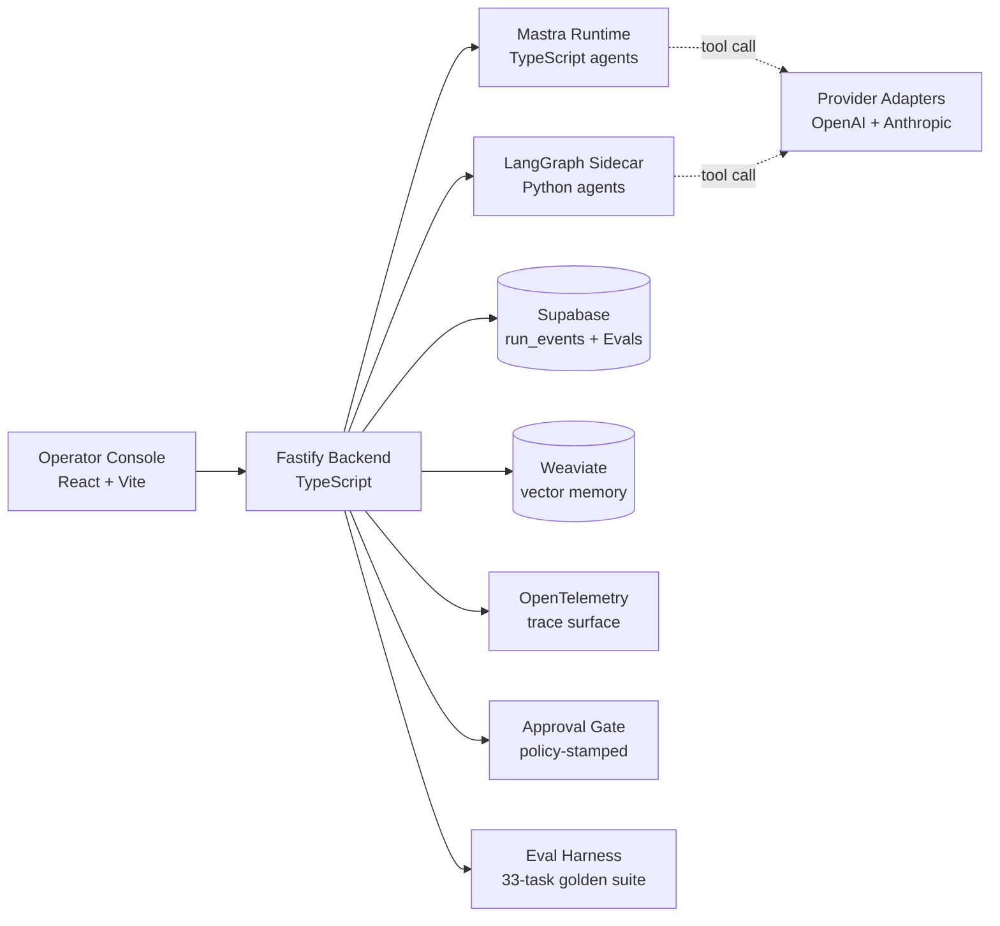

- `A`: Operator console at `frontend/`, React + Vite + Tailwind, served on port 5180.
- `B`: Fastify backend at `backend/`, TypeScript, port 4050. The single entry point.
- `C`: Mastra (TypeScript) runtime at `agents/src/mastra/`. 1 CEO + 10 orchestrators + 50 workers.
- `D`: LangGraph (Python) runtime at `agents/python/src/techtide_agents/runtime/`. Optional sidecar; the dual-runtime is what gives the harness breadth.
- `E`: Supabase holds `run_events` (append-only audit log), `EvalRun`, `ApprovalRequest`, RLS-gated per-org reads.
- `F`: Weaviate is the vector store for agent knowledge. The backend holds no state; queries are reversible.
- `G`: OpenTelemetry trace surface. Per-span `eval.*` attributes for trace-driven regression hunting.
- `H`: Provider adapters live in `apis/`. OpenAI Responses API + Anthropic Messages API. Both behind a typed `LLMProvider` contract.
- `I`: Approval gate. High-risk actions (`external`, `destructive`, `billing`) pause the run for human decision. The decision carries a `policyVersion` stamp.
- `J`: Eval harness. 33-task golden suite, four scorers, frozen baseline, 5% regression threshold, post-mortem auto-gen.

Looking for the 15-minute walkthrough script (6 diagrams, run-of-show dialogue, printable cheat sheet)? It is at [DEMO_WALKTHROUGH.md](DEMO_WALKTHROUGH.md) at the repo root. Designed for phone screen-shares, virtual interviews, and live demos.

## The mental model

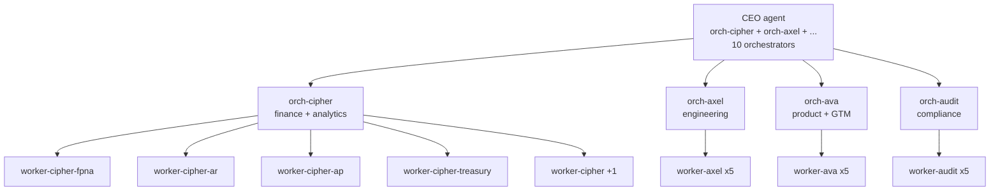

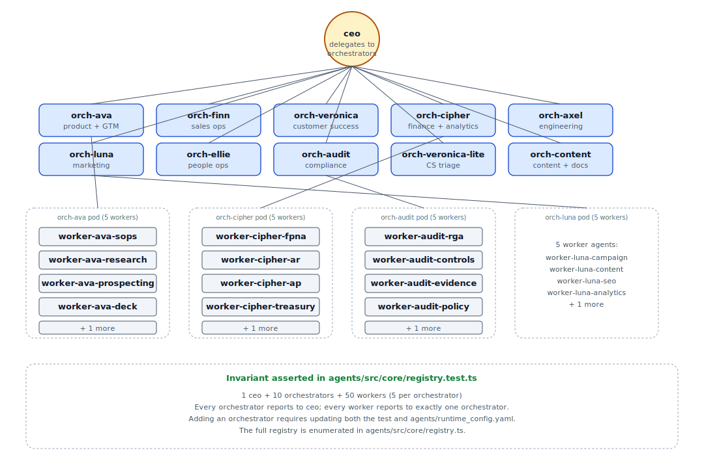

- **One CEO agent** at the top, delegating to the orchestrators. The CEO is a routine, not a person: "given a 33-task suite, decide which orchestrator handles which task." The routine lives in the harness.
- **Ten orchestrators** coordinating pods of workers and reviewing their output. Each owns a domain (engineering, finance, compliance, GTM, etc.).
- **Fifty workers** (five per orchestrator) doing the actual tool-calling work. Workers are named after real tools, not abstractions: `worker-cipher-fpna` is a real financial-planning job.

The 61-agent invariant is asserted in `agents/src/core/registry.test.ts` and fails the test suite the moment a worker is added without a sibling.

## The four planes

| Plane | What lives here | Where to read |
|---|---|---|
| **Control** | CEO + orchestrators, dispatching, risk classification | `agents/src/core/registry.ts`, [ADR 0003](docs/adr/0003-dual-runtime.md) |
| **Execution** | Workers, tool calls, workflow runs, contracts | `agents/src/mastra/`, `agents/src/runtime/`, [ADR 0007](docs/adr/0007-skills-vs-tools.md) |
| **Evidence** | `run_events`, traces, post-mortems, evals | `backend/src/services/trace-service.ts`, [EVALS.md](docs/EVALS.md), [ADR 0005](docs/adr/0005-trace-and-memory.md) |
| **Product** | Operator console | `frontend/src/pages/` |

## Architecture

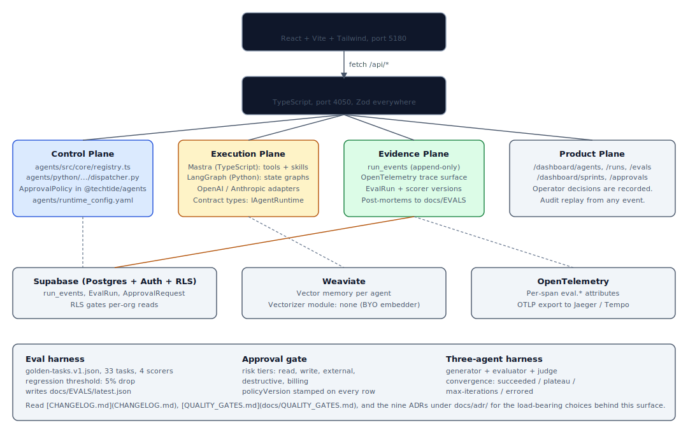

The full system, from operator console to Fastify backend to Mastra (TypeScript) and LangGraph (Python) runtimes, with Supabase persistence, Weaviate retrieval, OpenTelemetry traces, and the eval / approval / post-mortem surfaces.

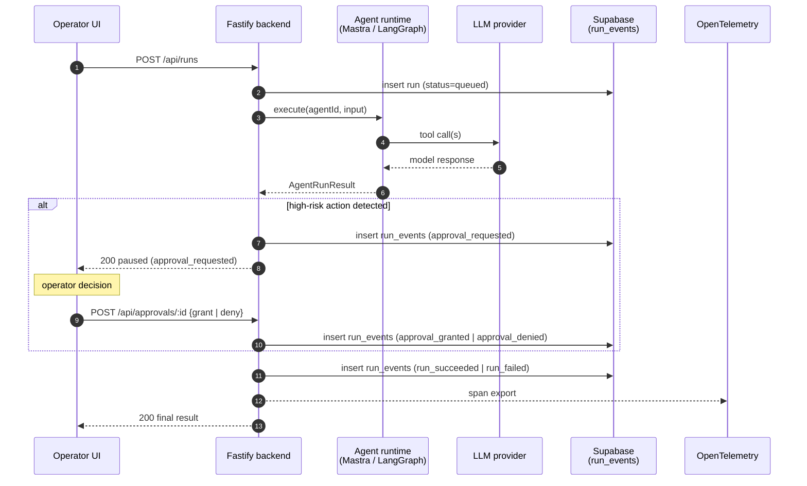

This is the canonical request flow. The point is that every arrow is a typed contract, every state change emits a `run_events` row, and the audit replay is one SQL query away.

## Customer scenario

TechTideAI exists for a problem a VP of Operations at a 200-person services firm lives every day. Their firm runs hundreds of operational queries a week, ticket volume, on-call rotations, SLA breaches, customer escalations, and the answers are scattered across three dashboards, a ticketing system, and a Slack channel. Leadership is exploring agentic tools, but the off-the-shelf products either (a) require a long implementation, (b) don't fit the firm's data residency rules, or (c) can't be evaluated against the firm's specific operational vocabulary.

An FDE at TechTideAI ships a harness. The firm's domain experts author a small set of golden tasks that represent the queries the firm actually wants answered ("what's our SLA breach rate for the last 30 days, by team?"). The harness runs those tasks against the firm's agent configuration nightly; any drop in pass rate pages the FDE. New tasks are added by opening a Jupyter notebook, iterating the candidate prompt, and committing the result to the eval suite. The dashboard shows the new task's score alongside the rest.

When the firm wants to add a high-risk action, say, "auto-approve a vendor payment under $1,000", the FDE does not bypass the approval gate. The harness classifies the action as `billing`; the run pauses; the operator (a human, not the FDE) decides. The decision is recorded in `run_events` with the policy version stamped on the row, so a future audit can replay the decision against the policy in force at the time.

This is what the harness is for: a system an FDE can ship, a customer's operators can monitor, and an auditor can replay. The customer scenario is in the README, not just the architecture diagram, because the architecture follows the scenario.

## What works today

A reader can walk the repo top-to-bottom and find a working surface behind every claim.

| Surface | Where | How to verify |
|---|---|---|
| Agent registry (1 CEO + 10 orchestrators + 50 workers) | `agents/src/core/registry.ts` | `pnpm -C agents test` (61-agent invariant asserted in `registry.test.ts`) |
| Skills vs. tools distinction | `agents/src/skills/`, [ADR 0007](docs/adr/0007-skills-vs-tools.md) | 3 skills (`prompt-iteration`, `tool-evaluator`, `contract-aware`) wired into every agent's system prompt |
| Mastra runtime (TypeScript) | `agents/src/mastra/`, `agents/src/runtime/mastra-runtime.ts` | `pnpm -C backend dev` then `POST /api/agents/:id/run` |
| LangGraph runtime (Python sidecar) | `agents/python/src/techtide_agents/runtime/` | `uvicorn techtide_agents.server:app --port 4051` + `LANGGRAPH_SIDECAR_URL` |
| Eval harness with scorer framework | `backend/src/services/eval-harness.ts`, `backend/src/services/scoring/` | `pnpm -C backend evals --suite golden-tasks.v1` |
| Four-axis grader + plateau detector | `backend/src/services/scoring/four-axis-grader.ts`, `plateau-scorer.ts` | Used by every sprint contract in `evals/sprints/` |
| Three-agent adversarial harness | `backend/src/services/three-agent-harness.ts`, `/dashboard/sprints` | `pnpm -C backend sprint --contract evals/sprints/well-scoped-sprint.v1.json` |
| Sprint contracts | `evals/sprints/well-scoped-sprint.v1.json`, [README](evals/sprints/README.md) | One example contract; add more as needed |
| Golden task fixtures | `evals/fixtures/golden-tasks.v1.json` | 33 tasks across all 10 orchestrators + CEO |
| Notebook authoring surface | `notebooks/`, `notebooks/_bridge.py`, `scripts/convert-notebooks.py` | 3 hand-written notebooks; run via Jupyter or read as `.py` |
| Approval gate (HITL) | `backend/src/services/approval-service.ts`, `/dashboard/approvals` | Submit a high-risk action, see it paused in the UI |
| OpenTelemetry trace surface (enriched) | `backend/src/services/trace-service.ts` | `GET /api/runs/:id/trace`, per-span `eval.*` attributes |
| Mastra memory | `agents/src/mastra/memory.ts`, `database/supabase/migrations/0005_mastra_memory.sql` | Boot with `SUPABASE_URL` |
| Post-mortem auto-generation | `backend/src/services/post-mortem-service.ts` | Run any agent, `docs/EVALS/post-mortems/<run-id>.md` is emitted |
| TS / Python contract sync | `contracts/schema.json`, `scripts/sync-contracts.ts` | `pytest agents/python/tests/test_contract_sync.py` |
| Containerized local stack | `Dockerfile.{backend,frontend,agents,python}`, `docker-compose.yml` | `docker compose up --build` |
| Agent-legible procedural memory | [AGENTS.md](AGENTS.md) (root) | Read on session start |

### TypeScript and Python share one contract

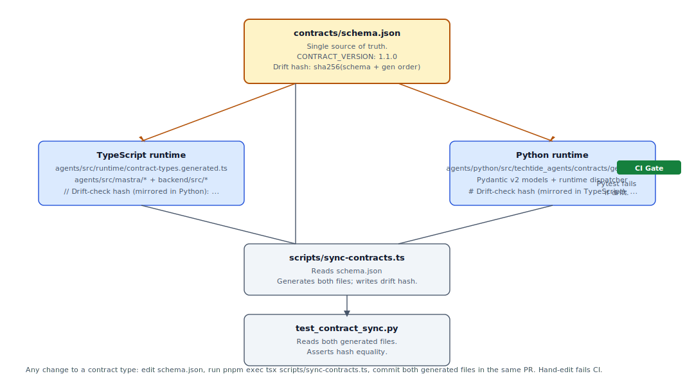

`contracts/schema.json` is the single source of truth. `scripts/sync-contracts.ts` regenerates the TypeScript and Pydantic types and stamps the same drift-check hash on both. Any hand-edit to either generated file fails CI. To add a contract type, edit `schema.json`, run the sync, and commit the regenerated files in the same PR.

### Three-agent harness loop

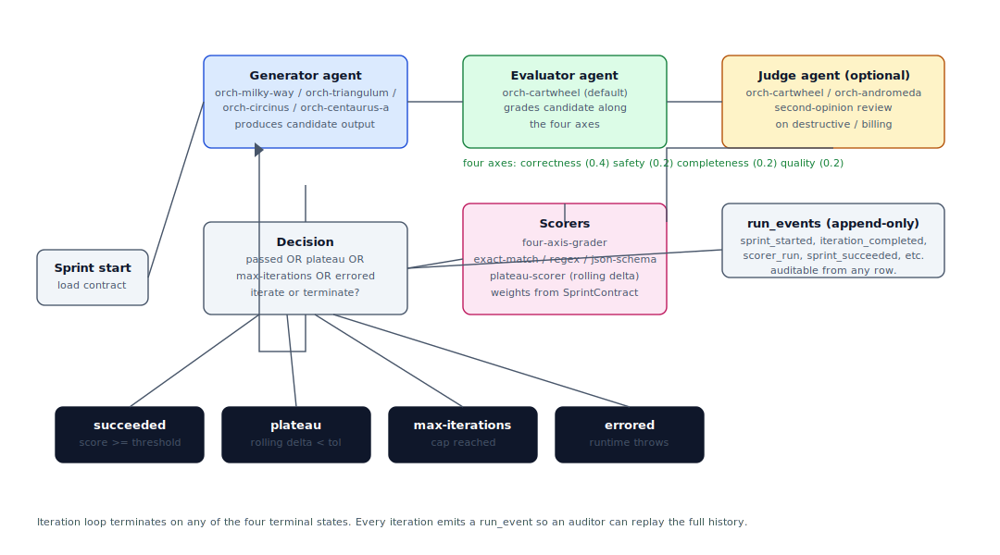

The sprint harness runs a generator, an evaluator, and an optional judge in a loop. Every iteration emits an append-only `run_event` (sprint_started, iteration_completed, scorer_run, sprint_succeeded, ...). The loop terminates on one of four states: `succeeded`, `plateau`, `max-iterations`, or `errored`. The decision branch and the rolling-delta plateau detector live in `backend/src/services/three-agent-harness.ts` and `backend/src/services/scoring/plateau-scorer.ts`.

### Run lifecycle and the approval gate

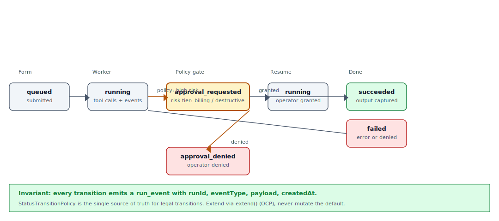

A run starts queued, transitions through running, and (when the policy classifies the action as high risk, i.e. `external`, `destructive`, or `billing`) pauses at `approval_requested` until a human operator decides. The decision is recorded in `run_events` with the policy version stamped on the row, so a future audit can replay the decision against the policy in force at the time. `StatusTransitionPolicy` is the single source of truth for legal transitions; extend via `extend()` (OCP), never mutate the default.

## Success metrics we track

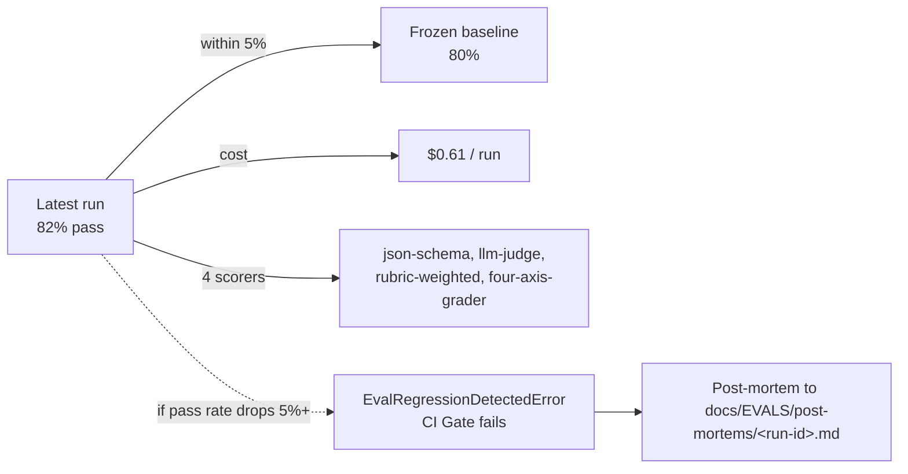

| Metric | Target | How it's measured |
|---|---|---|
| `golden-tasks.v1` pass rate | ≥ 80% on the full 33-task suite | `pnpm -C backend evals --suite golden-tasks.v1` |
| Orchestrator p95 latency | < 8s (Mastra + LangGraph) | `GET /api/evals/runs/:id` (per-task `latencyMs`) |
| Sprint convergence rate | ≥ 70% of sprints reach `succeeded` or `plateau` in ≤ 3 iterations | `pnpm -C backend sprint --contract <id>` |
| Approval queue median time-to-decision | < 4 hours | `GET /api/approvals` |
| Eval-suite cost per run | < $1 against gpt-4o + gpt-4o judge | `EvalRunSummary.totalCostUsd` |
| Per-task scorer-version drift | zero unrecorded changes | `EvalRun.scorerVersions` vs the previous run |

If any of these slips, the FDE writes a follow-up task. The eval suite *is* the regression dashboard.

## Quick start

```powershell
git clone https://github.com/Alexi5000/TechTideAI2.git
cd TechTideAI2
pnpm install
```

Copy the env templates and fill in the values you have:

```powershell
cp backend/.env.example backend/.env
cp frontend/.env.example frontend/.env
cp agents/.env.example agents/.env
cp agents/python/.env.example agents/python/.env
```

Run local services (the canonical scripts are in `package.json`):

```powershell
pnpm run dev:backend    # Fastify on :4050
pnpm run dev:frontend   # Vite on :5180
pnpm run dev:agents     # Mastra dev console
```

Optional: bring up the Python sidecar:

```powershell
cd agents/python
python -m pip install -e ".[dev,server]"
SIDECAR_PORT=4051 uvicorn techtide_agents.server:app --host 0.0.0.0 --port 4051
```

Then add to `backend/.env`:

```
LANGGRAPH_SIDECAR_URL=http://localhost:4051
```

Full Windows-local setup walkthrough is at [docs/DEV_SETUP.md](docs/DEV_SETUP.md).

## How to verify

```powershell
pnpm run verify        # lint + test + build across every TS workspace
```

This is the release gate. It must be green before any PR merges.

For the eval harness:

```powershell
pnpm -C backend evals --suite golden-tasks.v1 --write-docs
```

This writes `docs/EVALS/latest.json` and a per-run summary. The dashboard at `/dashboard/evals` reads from this surface.

For the Python runtime:

```powershell
cd agents/python
python -m pip install -e ".[dev,server]"
python -m pytest
python -m ruff check .
python -m ruff format --check .
```

For contract sync (the TS / Python drift check):

```powershell
pnpm exec tsx scripts/sync-contracts.ts
```

Full quality-gate walkthrough is at [docs/QUALITY_GATES.md](docs/QUALITY_GATES.md).

## Stack

| Area | Technology |
|---|---|
| Frontend | React, Vite, Tailwind v4, TypeScript, React Router 6 |
| Backend | Fastify 5, TypeScript, Zod |
| Agents (TypeScript) | Mastra, structured tools, `@techtide/apis` provider adapters |
| Agents (Python) | LangGraph, LangChain, Pydantic v2 |
| Provider adapters | OpenAI (Responses API) and Anthropic (Messages API) |
| Data | Supabase (Postgres + Auth + RLS), Weaviate |
| Quality | pnpm workspaces, Vitest, pytest + ruff, ESLint, TypeScript builds |
| Observability | OpenTelemetry (in-process or OTLP), structured `run_events` |

## Repository map

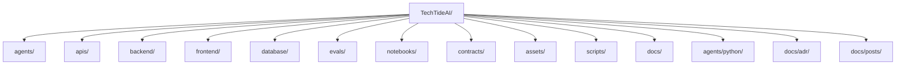

| Path | Purpose |
|---|---|
| `frontend/` | Operator console for agents, runs, evals, approvals, sprints. |
| `backend/` | Fastify orchestration API, routes, repositories, services, eval harness, scorer framework, three-agent harness, trace + post-mortem. |
| `agents/` | Agent registry (1 CEO + 10 + 50), Mastra runtime + tools + skills + memory, contract types. |
| `agents/python/` | Python LangGraph / LangChain runtime, dispatcher, contracts (Pydantic), FastAPI sidecar, notebook bridge. |
| `apis/` | Provider adapters (OpenAI Responses API, Anthropic Messages API). |
| `database/` | Supabase migrations, Weaviate docker-compose. |
| `evals/fixtures/` | Versioned golden task suites (the eval suite). |
| `evals/sprints/` | Versioned sprint contracts (the three-agent harness). |
| `contracts/` | Single source of truth for the TS / Python runtime contract. |
| `notebooks/` | Hand-written `.ipynb` authoring surface + sibling `.py` (reviewable). |
| `Dockerfile.*` | Per-service container images (backend, frontend, agents, python). |
| `docker-compose.yml` | Local stack, postgres, weaviate, backend, frontend, agents-python. |
| `scripts/` | `sync-contracts.ts`, `convert-notebooks.py`, `smoke-stack.sh`, `close-stale-deps-prs.sh`. |
| `docs/` | Architecture, dev setup, quality gates, eval methodology, ADRs, engineering blog, benchmark. |
| `assets/` | Repo-owned README graphics. |
| `AGENTS.md` | Procedural memory for any agent working in this repo. |
| `DEMO_WALKTHROUGH.md` | 15-minute presentation script (6 diagrams, run-of-show dialogue, printable cheat sheet). |
| `CHANGELOG.md`, `CONTRIBUTING.md`, `SECURITY.md` | Standard repo hygiene. |
| `.github/` | Workflows (CI, evals, pr, notebooks), PR template, issue templates, CODEOWNERS, dependabot. |

## Architecture decisions

The nine ADRs under `docs/adr/` describe the load-bearing choices. They are written in the order an FDE should read them.

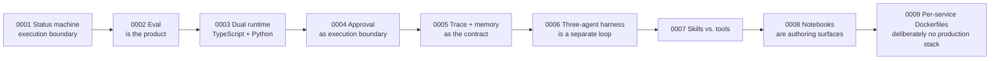

- [0001, Status machine as the execution boundary](docs/adr/0001-status-machine.md)
- [0002, Evaluation is part of the product](docs/adr/0002-eval-as-product.md)
- [0003, Dual runtime (TypeScript + Python)](docs/adr/0003-dual-runtime.md)
- [0004, Approval as execution boundary](docs/adr/0004-approval-as-execution-boundary.md)
- [0005, Trace and memory as the contract](docs/adr/0005-trace-and-memory.md)
- [0006, The three-agent harness is a separate loop](docs/adr/0006-three-agent-harness.md)
- [0007, Skills vs. tools](docs/adr/0007-skills-vs-tools.md)
- [0008, Notebooks are authoring surfaces, not runtimes](docs/adr/0008-notebook-authoring-surface.md)
- [0009, Per-service Dockerfiles + compose, deliberately no production stack](docs/adr/0009-containerization.md)

## Engineering blog

- [Lessons from building a company-scale agent OS](docs/posts/lessons-from-building-a-company-scale-agent-os.md)
- [The three-agent harness in TechTideAI](docs/posts/three-agent-harness.md)

## Quality gates

| Command | Scope |
|---|---|
| `pnpm run build` | Build all TypeScript workspaces. |
| `pnpm run lint` | Lint all TypeScript workspaces. |
| `pnpm run test` | Run all Vitest workspaces. |
| `pnpm run verify` | Lint + test + build as a release gate. |
| `pnpm -C backend evals` | Run the eval suite; emit a baseline to `docs/EVALS/`. |
| `pnpm exec tsx scripts/sync-contracts.ts` | Regenerate TS + Python contract files and assert drift hash equality. |

Python checks:

```powershell
cd agents/python
python -m pip install -e .[dev,server]
python -m pytest
python -m ruff check .
python -m ruff format --check .
```

See [Quality Gates](docs/QUALITY_GATES.md) for the full review standard.

## Operating principles

- Typed contracts over prompt soup.
- Logs and traces over vibes.
- Human approval where risk matters.
- Provider adapters behind clear interfaces.
- Evidence records for every important decision.
- Small, reviewable changes over giant unowned drops.

## License

MIT.