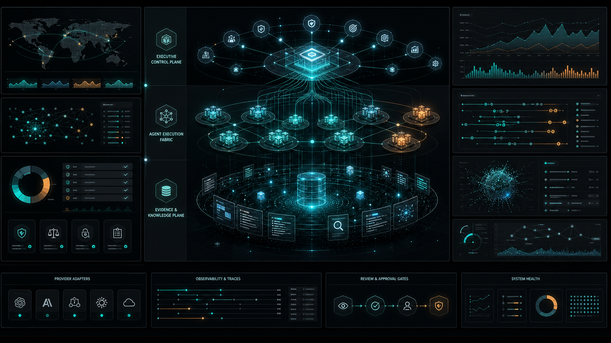

# TechTideAI



> **v0.2.0** — three-agent adversarial harness, skills-vs-tools, four-axis grader, plateau scorer, notebook authoring surface, containerized local stack, nine ADRs. See [CHANGELOG.md](CHANGELOG.md).

**TechTideAI** is a company-scale AI agent operating system for building, operating, and evaluating production agent teams. It combines a React operator console, a Fastify orchestration API, Mastra (TypeScript) agents, LangGraph (Python) orchestrators, OpenAI / Anthropic provider adapters, Supabase persistence, Weaviate retrieval, an in-process eval harness with regression detection, a human-in-the-loop approval gate, an OpenTelemetry trace surface, a skills-vs-tools distinction, a three-agent adversarial feedback harness, and a notebook authoring surface.

The repo is designed around one standard: **agent systems that ship.** Every major surface is typed, observable, testable, and reviewable.

## Customer scenario

TechTideAI exists to solve a problem that a VP of Operations at a 200-person services firm lives every day. Their firm runs hundreds of operational queries a week — ticket volume, on-call rotations, SLA breaches, customer escalations — and the answers are scattered across three dashboards, a ticketing system, and a Slack channel. The firm's leadership is exploring agentic tools, but the off-the-shelf products either (a) require a long implementation, (b) don't fit the firm's data residency rules, or (c) can't be evaluated against the firm's specific operational vocabulary.

A forward-deployed engineer at TechTideAI's operator ships a harness: the firm's domain experts author a small set of "golden" tasks that represent the queries the firm actually wants answered ("what's our SLA breach rate for the last 30 days, by team?"). The harness runs those tasks against the firm's agent configuration nightly; any drop in pass rate pages the FDE. New tasks are added as a Jupyter notebook is opened, the candidate prompt is iterated, the result is committed to the eval suite, and the dashboard shows the new task's score alongside the rest.

When the firm wants to add a high-risk action — say, "auto-approve a vendor payment under $1,000" — the FDE doesn't bypass the approval gate. The harness classifies the action as `billing`; the run pauses; the operator (a human, not the FDE) decides. The decision is recorded in `run_events` with the policy version stamped on the row, so a future audit can replay the decision against the policy in force at the time.

This is what the harness is for: a system that an FDE can ship into a customer environment, that a customer's operators can monitor, and that an auditor can replay. The customer scenario is in the README, not just in the architecture diagram, because the architecture follows the scenario.

## Success metrics we track

| Metric | Target | How it's measured |
|---|---|---|
| `golden-tasks.v1` pass rate | ≥ 80% on the full 33-task suite | `pnpm -C backend evals --suite golden-tasks.v1` |
| Orchestrator p95 latency | < 8s (Mastra + LangGraph) | `GET /api/evals/runs/:id` (per-task `latencyMs`) |
| Sprint convergence rate | ≥ 70% of sprints reach `succeeded` or `plateau` in ≤ 3 iterations | `pnpm -C backend sprint --contract <id>` |
| Approval queue median time-to-decision | < 4 hours | `GET /api/approvals` |
| Eval-suite cost per run | < $1 against gpt-4o + gpt-4o judge | `EvalRunSummary.totalCostUsd` |
| Per-task scorer-version drift | zero unrecorded changes | `EvalRun.scorerVersions` vs the previous run |

If any of these slips, the FDE writes a follow-up task. The eval suite *is* the regression dashboard.

## What works today

A reader can walk the repo top-to-bottom and find a working surface behind every claim.

| Surface | Where | How to verify |
|---|---|---|
| Agent registry (1 CEO + 10 orchestrators + 50 workers) | `agents/src/core/registry.ts` | `pnpm -C agents test` (61-agent invariant) |
| Skills vs. tools distinction | `agents/src/skills/`, `docs/adr/0007-skills-vs-tools.md` | 3 skills (prompt-iteration, tool-evaluator, contract-aware) wired into every agent's system prompt |
| Mastra runtime (TypeScript) | `agents/src/mastra/`, `agents/src/runtime/mastra-runtime.ts` | `pnpm -C backend dev:backend` then POST `/api/agents/:id/run` |
| LangGraph runtime (Python sidecar) | `agents/python/src/techtide_agents/runtime/` | `uvicorn techtide_agents.server:app --port 4051` + `LANGGRAPH_SIDECAR_URL` |
| Eval harness with scorer framework | `backend/src/services/eval-harness.ts`, `backend/src/services/scoring/` | `pnpm -C backend evals --suite golden-tasks.v1` |
| Four-axis grader + plateau detector | `backend/src/services/scoring/four-axis-grader.ts`, `plateau-scorer.ts` | Used by sprint contracts in `evals/sprints/` |
| Three-agent adversarial harness | `backend/src/services/three-agent-harness.ts`, `/dashboard/sprints` | `pnpm -C backend sprint --contract evals/sprints/well-scoped-sprint.v1.json` |
| Sprint contracts | `evals/sprints/well-scoped-sprint.v1.json`, `evals/sprints/README.md` | One example; add more as needed |
| Golden task fixtures | `evals/fixtures/golden-tasks.v1.json` | 33 tasks across all 10 orchestrators + CEO |
| Notebook authoring surface | `notebooks/`, `notebooks/_bridge.py`, `scripts/convert-notebooks.py` | 3 hand-written notebooks; run via Jupyter or read as `.py` |
| Approval gate (HITL) | `backend/src/services/approval-service.ts`, `/dashboard/approvals` | Submit a high-risk action, see it paused in the UI |
| OpenTelemetry trace surface (enriched) | `backend/src/services/trace-service.ts` | `GET /api/runs/:id/trace` — per-span `eval.*` attributes |
| Mastra memory | `agents/src/mastra/memory.ts`, `database/supabase/migrations/0005_mastra_memory.sql` | Boot with `SUPABASE_URL` |
| Post-mortem auto-generation | `backend/src/services/post-mortem-service.ts` | Run any agent; `docs/EVALS/post-mortems/<run-id>.md` |
| TS ↔ Python contract sync | `contracts/schema.json`, `scripts/sync-contracts.ts` | `pytest agents/python/tests/test_contract_sync.py` |
| Containerized local stack | `Dockerfile.{backend,frontend,agents,python}`, `docker-compose.yml` | `docker compose up --build` |
| Agent-legible procedural memory | `AGENTS.md` (root) | Read on session start |

## Why it exists

Production AI needs more than prompts. Teams need **agent registries, execution boundaries, API contracts, evaluation fixtures, memory surfaces, human approval paths, and logs that explain what happened.** TechTideAI is the engineering harness for those ideas — a product shell, an orchestration backend, two agent runtimes, an evidence plane, and docs that make the system understandable to future maintainers.

## Architecture

```text
                   Operator Console (React + Vite + Tailwind)
                                  │ fetch
                                  ▼
                       Fastify Backend (:4050)
                                  │
   ┌──────────────────────────────┼──────────────────────────────┐
   │                              │                              │
   ▼                              ▼                              ▼
Mastra agents                 Approval gate                 Eval harness
(TS, :in-process)            (HITL queue)                  (scoring, regression)
   │                              │                              │
   ▼                              ▼                              ▼
Run events → Supabase         ApprovalRequest → Supabase   EvalRun → Supabase
Tool calls → OpenTelemetry    Run pauses awaiting operator Pass-rate baseline
Post-mortems → docs/EVALS     decision                     → docs/EVALS/latest.json
                                                               │
   When LANGGRAPH_SIDECAR_URL is set:                            │
       ▼                                                        │
   LangGraph Bridge (:4051 → Python sidecar)                     │
       │                                                        │
       ▼                                                        │
   LangGraph orchestrator graphs (cipher, audit, …)               │
   Memory: Postgres + Weaviate                                  │
                                                               ─┘
```

The four planes:

| Layer | Purpose |
|---|---|
| **Control** | CEO agent, orchestrators, objectives, risk tiers, dispatching. |
| **Execution** | Worker pods, provider calls, tool calls, workflow runs, artifacts. |
| **Evidence** | Run events, knowledge records, vector search, traces, audit log, post-mortems. |
| **Product** | React operator console for inspecting agents, runs, evals, and approvals. |

## Stack

| Area | Technology |
|---|---|
| Frontend | React, Vite, Tailwind v4, TypeScript, React Router 6 |
| Backend | Fastify 5, TypeScript, Zod |
| Agents (TypeScript) | Mastra, structured tools, `@techtide/apis` provider adapters |
| Agents (Python) | LangGraph, LangChain, Pydantic v2 |
| Provider adapters | OpenAI (Responses API) and Anthropic (Messages API) |
| Data | Supabase (Postgres + Auth + RLS), Weaviate |
| Quality | pnpm workspaces, Vitest, pytest + ruff, ESLint, TypeScript builds |
| Observability | OpenTelemetry (in-process or OTLP), structured `run_events` |

## Quick start

```powershell
git clone https://github.com/Alexi5000/TechTideAI2.git
cd TechTideAI2
pnpm install
```

Copy the env templates and fill in the values you have:

```powershell
cp backend/.env.example backend/.env
cp frontend/.env.example frontend/.env
cp agents/.env.example agents/.env
cp agents/python/.env.example agents/python/.env
```

Run local services:

```powershell
pnpm run dev:backend    # Fastify on :4050
pnpm run dev:frontend   # Vite on :5180
pnpm run dev:agents     # Mastra dev console
```

Optional — bring up the Python sidecar:

```powershell
cd agents/python
python -m pip install -e ".[dev,server]"
SIDECAR_PORT=4051 uvicorn techtide_agents.server:app --host 0.0.0.0 --port 4051
```

Then add to `backend/.env`:

```
LANGGRAPH_SIDECAR_URL=http://localhost:4051
```

## How to verify

```powershell
pnpm run verify        # lint + test + build across every TS workspace
```

For the eval harness:

```powershell
pnpm -C backend evals --suite golden-tasks.v1 --write-docs
```

This writes `docs/EVALS/latest.json` and a per-run summary. The dashboard at `/dashboard/evals` reads from this surface.

For the Python runtime:

```powershell
cd agents/python
python -m pip install -e ".[dev,server]"
python -m pytest
python -m ruff check .
```

## Repository map

| Path | Purpose |
|---|---|
| `frontend/` | Operator console for agents, runs, evals, approvals, sprints. |
| `backend/` | Fastify orchestration API, routes, repositories, services, eval harness, scorer framework, three-agent harness, trace + post-mortem. |
| `agents/` | Agent registry (1 CEO + 10 + 50), Mastra runtime + tools + skills + memory, contract types. |
| `agents/python/` | Python LangGraph / LangChain runtime, dispatcher, contracts (Pydantic), FastAPI sidecar, notebook bridge. |
| `apis/` | Provider adapters (OpenAI Responses API, Anthropic Messages API). |
| `database/` | Supabase migrations, Weaviate docker-compose. |
| `evals/fixtures/` | Versioned golden task suites (the eval suite). |
| `evals/sprints/` | Versioned sprint contracts (the three-agent harness). |
| `contracts/` | Single source of truth for the TS ↔ Python runtime contract. |
| `notebooks/` | Hand-written `.ipynb` authoring surface + sibling `.py` (reviewable). |
| `Dockerfile.*` | Per-service container images (backend, frontend, agents, python). |
| `docker-compose.yml` | Local stack: postgres, weaviate, backend, frontend, agents-python. |
| `scripts/` | `sync-contracts.ts`, `convert-notebooks.py`, `smoke-stack.sh`, `close-stale-deps-prs.sh`. |
| `docs/` | Architecture, dev setup, quality gates, eval methodology, ADRs, engineering blog, benchmark. |
| `assets/` | Repo-owned README graphics. |
| `AGENTS.md` | Procedural memory for any agent working in this repo. |
| `CHANGELOG.md`, `CONTRIBUTING.md`, `SECURITY.md` | Standard repo hygiene. |
| `.github/` | Workflows (CI, deploy, evals, pr, notebooks, docker smoke), PR template, issue templates, CODEOWNERS, dependabot. |

## Architecture decisions

The nine ADRs under `docs/adr/` describe the load-bearing choices. They are written in the order an FDE should read them.

- [0001 — Status machine as the execution boundary](docs/adr/0001-status-machine.md)
- [0002 — Evaluation is part of the product](docs/adr/0002-eval-as-product.md)
- [0003 — Dual runtime (TypeScript + Python)](docs/adr/0003-dual-runtime.md)
- [0004 — Approval as execution boundary](docs/adr/0004-approval-as-execution-boundary.md)
- [0005 — Trace and memory as the contract](docs/adr/0005-trace-and-memory.md)
- [0006 — The three-agent harness is a separate loop](docs/adr/0006-three-agent-harness.md)
- [0007 — Skills vs. tools](docs/adr/0007-skills-vs-tools.md)
- [0008 — Notebooks are authoring surfaces, not runtimes](docs/adr/0008-notebook-authoring-surface.md)
- [0009 — Per-service Dockerfiles + compose, deliberately no production stack](docs/adr/0009-containerization.md)

## Engineering blog

- [Lessons from building a company-scale agent OS](docs/posts/lessons-from-building-a-company-scale-agent-os.md)
- [The three-agent harness in TechTideAI](docs/posts/three-agent-harness.md)

## Quality gates

| Command | Scope |
|---|---|
| `pnpm run build` | Build all TypeScript workspaces. |
| `pnpm run lint` | Lint all TypeScript workspaces. |
| `pnpm run test` | Run all Vitest workspaces. |
| `pnpm run verify` | Lint + test + build as a release gate. |
| `pnpm -C backend evals` | Run the eval suite; emit a baseline to `docs/EVALS/`. |

Python checks:

```powershell
cd agents/python
python -m pip install -e .[dev,server]
python -m pytest
python -m ruff check .
python -m ruff format --check .
```

See [Quality Gates](docs/QUALITY_GATES.md) for the full review standard.

## Operating principles

- Typed contracts over prompt soup.
- Logs and traces over vibes.
- Human approval where risk matters.
- Provider adapters behind clear interfaces.
- Evidence records for every important decision.
- Small, reviewable changes over giant unowned drops.

## License

MIT.
