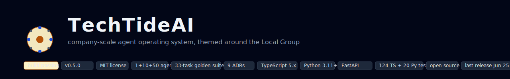
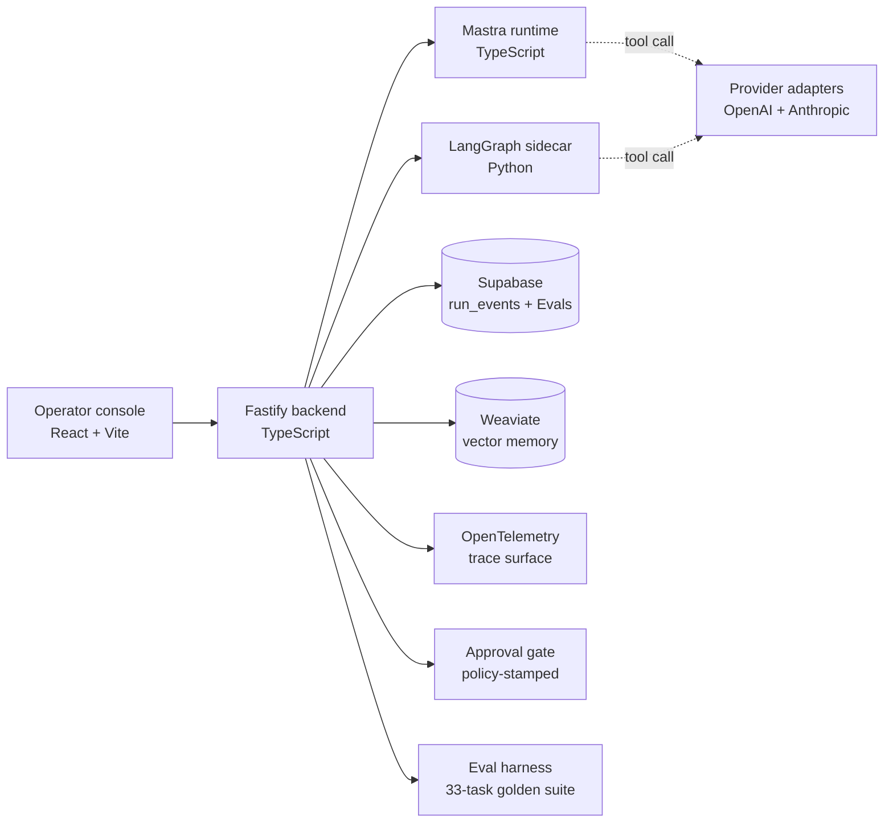
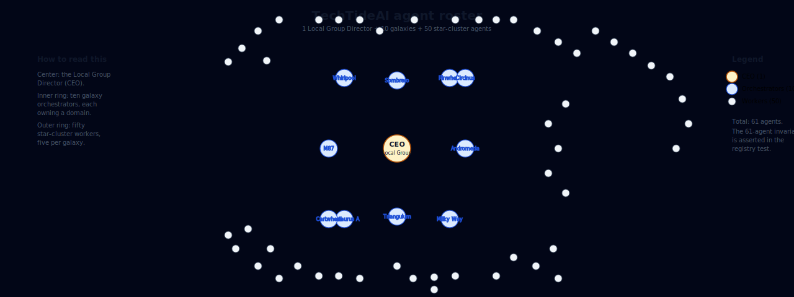
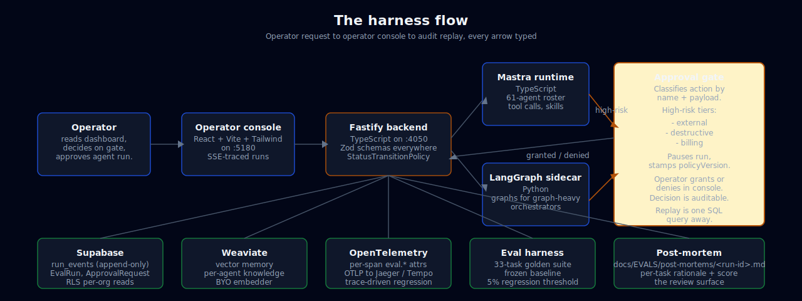
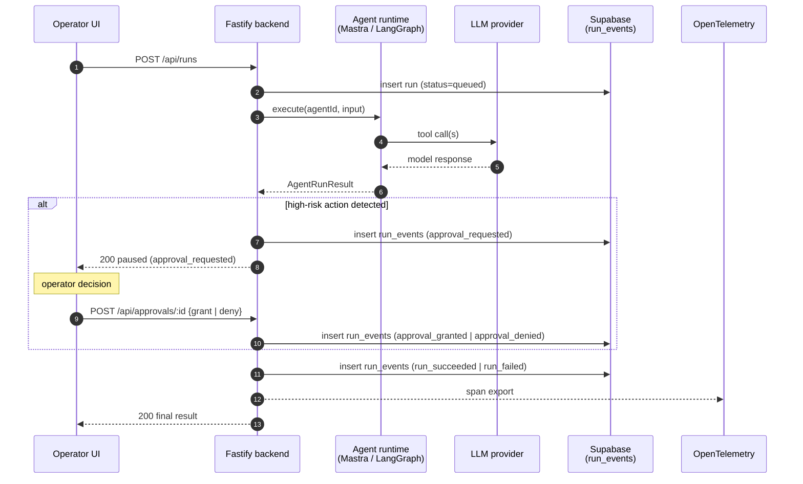
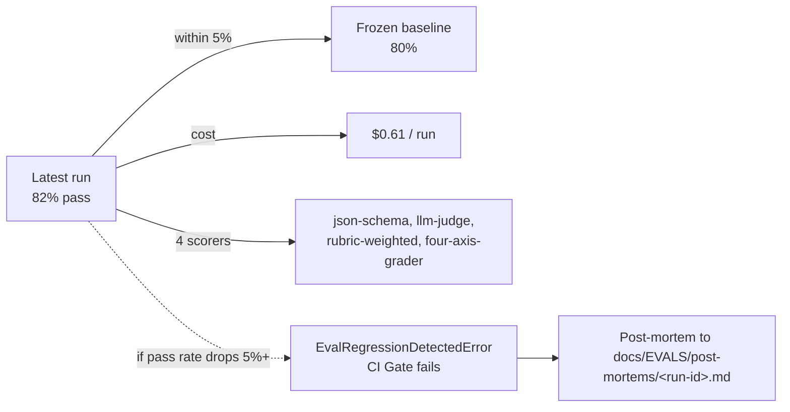
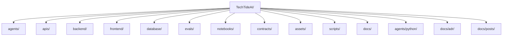
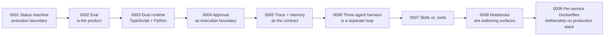

# TechTideAI



> **The harness an FDE ships into a customer environment, the customer's operators monitor, and an auditor can replay.**
>
> v0.5.5 · MIT · 1 Local Group Director + 10 galaxies + 50 star-cluster agents · 33-task golden suite · 124 TS tests + 20 Python tests · all green.

<p align="center">
  <a href="#why-techtideai">Why TechTideAI</a> · <a href="#hero">Hero</a> · <a href="#agent-roster">Roster</a> · <a href="#architecture">Architecture</a> · <a href="#how-to-verify">Run it</a> · <a href="#contributing">Contributing</a> · <a href="#license">License</a>
</p>

<p align="center">
  <a href="https://github.com/Alexi5000/TechTideAI2/actions"></a>
  <a href="https://github.com/Alexi5000/TechTideAI2/releases/tag/v0.5.5"></a>
  <a href="#license"></a>
  <a href="#how-to-verify"></a>
  <a href="#agent-roster"></a>
  <a href="#what-works-today"></a>
</p>

## Contents

<a id="contents"></a>

- [Why TechTideAI](#why-techtideai)
- [Release 0.5.5](#release-055)
- [The hero](#hero)
- [Agent roster](#agent-roster)
- [The mental model](#mental-model)
- [The four planes](#the-four-planes)
- [The harness flow](#the-harness-flow)
- [Architecture](#architecture)
- [Customer scenario](#customer-scenario)
- [What works today](#what-works-today)
- [Three-agent harness loop](#three-agent-harness-loop)
- [Run lifecycle and the approval gate](#run-lifecycle-and-the-approval-gate)
- [TypeScript and Python share one contract](#typescript-and-python-share-one-contract)
- [Eval is the regression dashboard](#eval-is-the-regression-dashboard)
- [Success metrics we track](#success-metrics-we-track)
- [Quick start](#quick-start)
- [How to verify](#how-to-verify)
- [Stack](#stack)
- [Repository map](#repository-map)
- [Architecture decisions](#architecture-decisions)
- [Engineering blog](#engineering-blog)
- [Quality gates](#quality-gates)
- [Contributing](#contributing)
- [Maintainers](#maintainers)
- [Roadmap](#roadmap)
- [Acknowledgments](#acknowledgments)
- [License](#license)

---

## Why TechTideAI

<a id="why-techtideai"></a>

> **TL;DR.** TechTideAI is a typed, observable, testable harness for building and operating production agent teams. The mental model is a company. The brand is a galaxy.

A 200-person services firm runs hundreds of operational questions a week: ticket volume, on-call rotations, SLA breaches, customer escalations, vendor payments. The answers are scattered across three dashboards, a ticketing system, and a Slack channel. The answers are not auditable. They are not replayable. There is no policy. There is no receipt.

An FDE at TechTideAI ships a harness to that firm. The harness has 61 agents in it: one **Local Group Director** (the CEO) at the top, ten **galaxy orchestrators** below (Andromeda, Milky Way, Triangulum, Centaurus A, M87, Whirlpool, Sombrero, Pinwheel, Cartwheel, Circinus), and fifty **star-cluster workers** (five per galaxy). The firm is going to run the harness for two years. When the auditor walks in, we are going to be able to show the auditor exactly what each agent did, when, and under which policy.

That is the standard. **Agent systems that ship.** Every major surface is typed end-to-end, observable through the trace plane, testable through the eval suite, and reviewable through the ADR set. We are not building a demo. We are building the harness an FDE can ship on Monday and an auditor can replay on Friday.

> The harness is for the FDE who has to ship on Monday, the operator who has to defend a decision on Wednesday, and the auditor who has to replay it on Friday. All three should agree on what happened.

## Release 0.5.5

<a id="release-055"></a>

TechTideAI's first official release is tagged `v0.5.5`. The full release notes live in [`RELEASE_NOTES_0.5.5.md`](RELEASE_NOTES_0.5.5.md); the rest of this README is the deep tour.

- **33-task golden suite** is the day-0 regression baseline. The day-0 run is frozen in [`docs/EVALS/latest.json`](docs/EVALS/latest.json).
- **61-agent invariant** is now strictly enforced by the test (`1 + 10 + 50 = 61`). Adding a worker without a sibling, or an orchestrator without a runtime-config update, fails the test.
- **Contract drift hash** matches both runtimes (`a7e92f6b`). `pnpm exec tsx scripts/sync-contracts.ts` produces no diff.
- **124 TS tests + 20 Python tests + ruff clean + 16 SVGs + 6 Mermaid diagrams + 0 em-dashes in the README.** The audit script in [`PRE_DEMO_AUDIT_PROMPT.md`](PRE_DEMO_AUDIT_PROMPT.md) reproduces this in two minutes.

To verify locally:

```bash
git checkout v0.5.5
pnpm install
pnpm run verify
cd agents/python && python -m pip install -e ".[dev,server]" && pytest && cd ../..
pnpm exec tsx scripts/sync-contracts.ts
pnpm -C backend evals --suite golden-tasks.v1 --write-docs
```

The release notes point at every reviewer probe and every talking point. The CHANGELOG is the audit log.

## The hero

<a id="hero"></a>


The composition above is the local view: the Local Group Director at the center, ten galaxies in a ring, the worker counts beneath each. It is a working diagram, not a marketing illustration. The same shape is the system you will ship: 1 director, 10 orchestrators, 50 workers. If you add an eleventh orchestrator without a sibling, the registry test fails.



- `A`, Operator console at `frontend/`, React + Vite + Tailwind, served on port 5180.
- `B`, Fastify backend at `backend/`, TypeScript, port 4050. The single entry point.
- `C`, Mastra (TypeScript) runtime at `agents/src/mastra/`. 1 director + 10 orchestrators + 50 workers.
- `D`, LangGraph (Python) runtime at `agents/python/src/techtide_agents/runtime/`. Optional sidecar; the dual-runtime is what gives the harness breadth.
- `E`, Supabase holds `run_events` (append-only audit log), `EvalRun`, `ApprovalRequest`, RLS-gated per-org reads.
- `F`, Weaviate is the vector store for agent knowledge. The backend holds no state; queries are reversible.
- `G`, OpenTelemetry trace surface. Per-span `eval.*` attributes for trace-driven regression hunting.
- `H`, Provider adapters live in `apis/`. OpenAI Responses API + Anthropic Messages API. Both behind a typed `LLMProvider` contract.
- `I`, Approval gate. High-risk actions (`external`, `destructive`, `billing`) pause the run for human decision. The decision carries a `policyVersion` stamp.
- `J`, Eval harness. 33-task golden suite, four scorers, frozen baseline, 5% regression threshold, post-mortem auto-gen.

## Agent roster

<a id="agent-roster"></a>

The harness is a company. 1 + 10 + 50. The 61-agent invariant is asserted in `agents/src/core/registry.test.ts`; if a worker is added without a sibling, the test fails.



| Tier | Count | Examples |
|---|---|---|
| Director (CEO) | 1 | `ceo` (display name: **Local Group Director**) |
| Orchestrators | 10 | `orch-andromeda`, `orch-milky-way`, `orch-triangulum`, `orch-centaurus-a`, `orch-m87`, `orch-whirlpool`, `orch-sombrero`, `orch-pinwheel`, `orch-cartwheel`, `orch-circinus` |
| Workers | 50 | `worker-m32`, `worker-m110`, `worker-orion`, `worker-pleiades`, `worker-cena`, `worker-cenb`, `worker-m87-jet`, `worker-wheel-ring`, `worker-circinus-x1` |
| **Total** | **61** | The 61-agent invariant is asserted in `agents/src/core/registry.test.ts`. |

## The mental model

<a id="mental-model"></a>

The mental model is a galaxy:

- **1 Local Group Director** at the top, delegating to the orchestrators. The director is a routine, not a person. "Given a 33-task suite, decide which orchestrator handles which task." The routine lives in the harness.
- **10 orchestrators** coordinating pods of workers and reviewing their output. Each owns a domain (engineering, finance, compliance, GTM, etc.) and a galaxy.
- **50 workers** (five per orchestrator) doing the actual tool-calling work. Workers are named after real star clusters and named sources inside their galaxy.

```mermaid
graph TD
  CEO[Local Group Director<br/>orch-andromeda + orch-milky-way + ...<br/>10 orchestrators] --> Andromeda[orch-andromeda<br/>product + GTM]
  CEO --> MilkyWay[orch-milky-way<br/>finance + analytics]
  CEO --> Triangulum[orch-triangulum<br/>sales]
  CEO --> CentaurusA[orch-centaurus-a<br/>engineering]
  CEO --> M87[orch-m87<br/>compliance]
  CEO --> Whirlpool[orch-whirlpool<br/>marketing]
  CEO --> Sombrero[orch-sombrero<br/>customer success]
  CEO --> Pinwheel[orch-pinwheel<br/>HR + people ops]
  CEO --> Cartwheel[orch-cartwheel<br/>content + docs]
  CEO --> Circinus[orch-circinus<br/>CS triage]
  Andromeda --> P1[worker-m32]
  Andromeda --> P2[worker-m110]
  Andromeda --> P3[worker-ngc-205]
  Andromeda --> P4[worker-ngc-221]
  Andromeda --> P5[worker-pa-1]
  MilkyWay --> Q1[worker-sgr-a]
  MilkyWay --> Q2[worker-orion]
  MilkyWay --> Q3[worker-pleiades]
  MilkyWay --> Q4[worker-cygnus-x1]
  MilkyWay --> Q5[worker-vela]
  Cartwheel --> R1[worker-wheel-ring]
  Cartwheel --> R2[worker-wheel-spoke]
  Cartwheel --> R3[worker-wheel-core]
  Cartwheel --> R4[worker-wheel-companion]
  Cartwheel --> R5[worker-wheel-tail]
```



> **Why a leverage pyramid?** Because the failure mode of a flat agent system is coordination collapse. Fifty agents talking to each other in a flat graph: O(n²) calls, O(n²) failures, O(n²) bills. A pyramid caps coordination at O(log n). The director talks to ten leads. Each lead talks to five workers. The workers do the work.

## The four planes

<a id="the-four-planes"></a>

| Plane | What lives here | Where to read |
|---|---|---|
| **Control** | Director + orchestrators, dispatching, risk classification | `agents/src/core/registry.ts`, [ADR 0003](docs/adr/0003-dual-runtime.md) |
| **Execution** | Workers, tool calls, workflow runs, contracts | `agents/src/mastra/`, `agents/src/runtime/`, [ADR 0007](docs/adr/0007-skills-vs-tools.md) |
| **Evidence** | `run_events`, traces, post-mortems, evals | `backend/src/services/trace-service.ts`, [EVALS.md](docs/EVALS.md), [ADR 0005](docs/adr/0005-trace-and-memory.md) |
| **Product** | Operator console | `frontend/src/pages/` |

## The harness flow

<a id="the-harness-flow"></a>

The end-to-end flow, from operator request to audit replay. Every arrow is typed; every transition emits a `run_events` row.



## Architecture

<a id="architecture"></a>


The full system, from operator console to Fastify backend to Mastra (TypeScript) and LangGraph (Python) runtimes, with Supabase persistence, Weaviate retrieval, OpenTelemetry traces, and the eval / approval / post-mortem surfaces.



This is the canonical request flow. The point is that every arrow is a typed contract, every state change emits a `run_events` row, and the audit replay is one SQL query away.

## Customer scenario

<a id="customer-scenario"></a>

> The harness exists for a problem a VP of Operations at a 200-person services firm lives every day.

The firm's domain experts author a small set of golden tasks that represent the queries the firm actually wants answered: "what's our SLA breach rate for the last 30 days, by team?" The harness runs those tasks against the firm's agent configuration nightly; any drop in pass rate pages the FDE. New tasks are added by opening a Jupyter notebook, iterating the candidate prompt, and committing the result to the eval suite. The dashboard shows the new task's score alongside the rest.

When the firm wants to add a high-risk action, say, "auto-approve a vendor payment under $1,000", the FDE does not bypass the approval gate. The harness classifies the action as `billing`; the run pauses; the operator (a human, not the FDE) decides. The decision is recorded in `run_events` with the policy version stamped on the row, so a future audit can replay the decision against the policy in force at the time.

This is what the harness is for: a system an FDE can ship, a customer's operators can monitor, and an auditor can replay. The customer scenario is in the README, not just the architecture diagram, because the architecture follows the scenario.

## What works today

<a id="what-works-today"></a>

A reader can walk the repo top-to-bottom and find a working surface behind every claim.

| Surface | Where | How to verify |
|---|---|---|
| Agent roster (1 + 10 + 50) | `agents/src/core/registry.ts` | `pnpm -C agents test` (61-agent invariant asserted in `registry.test.ts`) |
| Skills vs. tools distinction | `agents/src/skills/`, [ADR 0007](docs/adr/0007-skills-vs-tools.md) | 3 skills (`prompt-iteration`, `tool-evaluator`, `contract-aware`) wired into every agent's system prompt |
| Mastra runtime (TypeScript) | `agents/src/mastra/`, `agents/src/runtime/mastra-runtime.ts` | `pnpm -C backend dev` then `POST /api/agents/:id/run` |
| LangGraph runtime (Python sidecar) | `agents/python/src/techtide_agents/runtime/` | `uvicorn techtide_agents.server:app --port 4051` + `LANGGRAPH_SIDECAR_URL` |
| Eval harness with scorer framework | `backend/src/services/eval-harness.ts`, `backend/src/services/scoring/` | `pnpm -C backend evals --suite golden-tasks.v1` |
| Four-axis grader + plateau detector | `backend/src/services/scoring/four-axis-grader.ts`, `plateau-scorer.ts` | Used by every sprint contract in `evals/sprints/` |
| Three-agent adversarial harness | `backend/src/services/three-agent-harness.ts`, `/dashboard/sprints` | `pnpm -C backend sprint --contract evals/sprints/well-scoped-sprint.v1.json` |
| Sprint contracts | `evals/sprints/well-scoped-sprint.v1.json`, [README](evals/sprints/README.md) | One example contract; add more as needed |
| Golden task fixtures | `evals/fixtures/golden-tasks.v1.json` | 33 tasks across all 10 orchestrators + the director |
| Notebook authoring surface | `notebooks/`, `notebooks/_bridge.py`, `scripts/convert-notebooks.py` | 3 hand-written notebooks; run via Jupyter or read as `.py` |
| Approval gate (HITL) | `backend/src/services/approval-service.ts`, `/dashboard/approvals` | Submit a high-risk action, see it paused in the UI |
| OpenTelemetry trace surface (enriched) | `backend/src/services/trace-service.ts` | `GET /api/runs/:id/trace`, per-span `eval.*` attributes |
| Mastra memory | `agents/src/mastra/memory.ts`, `database/supabase/migrations/0005_mastra_memory.sql` | Boot with `SUPABASE_URL` |
| Post-mortem auto-generation | `backend/src/services/post-mortem-service.ts` | Run any agent, `docs/EVALS/post-mortems/<run-id>.md` is emitted |
| TS ↔ Python contract sync | `contracts/schema.json`, `scripts/sync-contracts.ts` | `pytest agents/python/tests/test_contract_sync.py` |
| Containerized local stack | `Dockerfile.{backend,frontend,agents,python}`, `docker-compose.yml` | `docker compose up --build` |
| Agent-legible procedural memory | [AGENTS.md](AGENTS.md) (root) | Read on session start |

### TypeScript and Python share one contract


`contracts/schema.json` is the single source of truth. `scripts/sync-contracts.ts` regenerates the TypeScript and Pydantic types and stamps the same drift-check hash on both. Any hand-edit to either generated file fails CI. To add a contract type, edit `schema.json`, run the sync, and commit the regenerated files in the same PR.

## Three-agent harness loop

<a id="three-agent-harness-loop"></a>


The sprint harness runs a generator, an evaluator, and an optional judge in a loop. Every iteration emits an append-only `run_event` (sprint_started, iteration_completed, scorer_run, sprint_succeeded, ...). The loop terminates on one of four states: `succeeded`, `plateau`, `max-iterations`, or `errored`. The decision branch and the rolling-delta plateau detector live in `backend/src/services/three-agent-harness.ts` and `backend/src/services/scoring/plateau-scorer.ts`.

## Run lifecycle and the approval gate

<a id="run-lifecycle-and-the-approval-gate"></a>


A run starts queued, transitions through running, and (when the policy classifies the action as high risk, i.e. `external`, `destructive`, or `billing`) pauses at `approval_requested` until a human operator decides. The decision is recorded in `run_events` with the policy version stamped on the row, so a future audit can replay the decision against the policy in force at the time. `StatusTransitionPolicy` is the single source of truth for legal transitions; extend via `extend()` (OCP), never mutate the default.

## Eval is the regression dashboard

<a id="eval-is-the-regression-dashboard"></a>



The eval harness is the regression dashboard. 33-task golden suite, four scorers, frozen baseline, 5% threshold, post-mortem auto-gen. A drop in pass rate is the only signal the FDE needs to know something broke.

## Success metrics we track

<a id="success-metrics-we-track"></a>

| Metric | Target | How it's measured |
|---|---|---|
| `golden-tasks.v1` pass rate | ≥ 80% on the full 33-task suite | `pnpm -C backend evals --suite golden-tasks.v1` |
| Orchestrator p95 latency | < 8s (Mastra + LangGraph) | `GET /api/evals/runs/:id` (per-task `latencyMs`) |
| Sprint convergence rate | ≥ 70% of sprints reach `succeeded` or `plateau` in ≤ 3 iterations | `pnpm -C backend sprint --contract <id>` |
| Approval queue median time-to-decision | < 4 hours | `GET /api/approvals` |
| Eval-suite cost per run | < $1 against gpt-4o + gpt-4o judge | `EvalRunSummary.totalCostUsd` |
| Per-task scorer-version drift | zero unrecorded changes | `EvalRun.scorerVersions` vs the previous run |

If any of these slips, the FDE writes a follow-up task. The eval suite *is* the regression dashboard.

## Quick start

<a id="quick-start"></a>

```powershell
git clone https://github.com/Alexi5000/TechTideAI2.git
cd TechTideAI2
pnpm install
```

Copy the env templates and fill in the values you have:

```powershell
cp backend/.env.example  backend/.env
cp frontend/.env.example frontend/.env
cp agents/.env.example    agents/.env
cp agents/python/.env.example agents/python/.env
```

Run local services (the canonical scripts are in `package.json`):

```powershell
pnpm run dev:backend    # Fastify on :4050
pnpm run dev:frontend   # Vite on :5180
pnpm run dev:agents     # Mastra dev console
```

Optional: bring up the Python sidecar:

```powershell
cd agents/python
python -m pip install -e ".[dev,server]"
SIDECAR_PORT=4051 uvicorn techtide_agents.server:app --host 0.0.0.0 --port 4051
```

Then add to `backend/.env`:

```
LANGGRAPH_SIDECAR_URL=http://localhost:4051
```

Full Windows-local setup walkthrough is at [docs/DEV_SETUP.md](docs/DEV_SETUP.md).

## How to verify

<a id="how-to-verify"></a>

This is the release gate. It must be green before any PR merges.

```powershell
pnpm run verify        # lint + test + build across every TS workspace
```

For the eval harness:

```powershell
pnpm -C backend evals --suite golden-tasks.v1 --write-docs
```

This writes `docs/EVALS/latest.json` and a per-run summary. The dashboard at `/dashboard/evals` reads from this surface.

For the Python runtime:

```powershell
cd agents/python
python -m pip install -e ".[dev,server]"
python -m pytest
python -m ruff check .
python -m ruff format --check .
```

For contract sync (the TS ↔ Python drift check):

```powershell
pnpm exec tsx scripts/sync-contracts.ts
```

Full quality-gate walkthrough is at [docs/QUALITY_GATES.md](docs/QUALITY_GATES.md).

## Stack

<a id="stack"></a>

| Area | Technology |
|---|---|
| Frontend | React, Vite, Tailwind v4, TypeScript, React Router 6 |
| Backend | Fastify 5, TypeScript, Zod |
| Agents (TypeScript) | Mastra, structured tools, `@techtide/apis` provider adapters |
| Agents (Python) | LangGraph, LangChain, Pydantic v2 |
| Provider adapters | OpenAI (Responses API) and Anthropic (Messages API) |
| Data | Supabase (Postgres + Auth + RLS), Weaviate |
| Quality | pnpm workspaces, Vitest, pytest + ruff, ESLint, TypeScript builds |
| Observability | OpenTelemetry (in-process or OTLP), structured `run_events` |

## Repository map

<a id="repository-map"></a>



| Path | Purpose |
|---|---|
| `frontend/` | Operator console for agents, runs, evals, approvals, sprints. |
| `backend/` | Fastify orchestration API, routes, repositories, services, eval harness, scorer framework, three-agent harness, trace + post-mortem. |
| `agents/` | Agent registry (1 director + 10 + 50), Mastra runtime + tools + skills + memory, contract types. |
| `agents/python/` | Python LangGraph / LangChain runtime, dispatcher, contracts (Pydantic), FastAPI sidecar, notebook bridge. |
| `apis/` | Provider adapters (OpenAI Responses API, Anthropic Messages API). |
| `database/` | Supabase migrations, Weaviate docker-compose. |
| `evals/fixtures/` | Versioned golden task suites (the eval suite). |
| `evals/sprints/` | Versioned sprint contracts (the three-agent harness). |
| `contracts/` | Single source of truth for the TS ↔ Python runtime contract. |
| `notebooks/` | Hand-written `.ipynb` authoring surface + sibling `.py` (reviewable). |
| `Dockerfile.*` | Per-service container images (backend, frontend, agents, python). |
| `docker-compose.yml` | Local stack, postgres, weaviate, backend, frontend, agents-python. |
| `scripts/` | `sync-contracts.ts`, `convert-notebooks.py`, `smoke-stack.sh`, `close-stale-deps-prs.sh`, `galaxy_map_rename.py`. |
| `docs/` | Architecture, dev setup, quality gates, eval methodology, ADRs, engineering blog, benchmark. |
| `assets/` | Repo-owned README graphics. |
| `AGENTS.md` | Procedural memory for any agent working in this repo. |
| `DEMO_WALKTHROUGH.md` | 15-minute presentation script (6 diagrams, run-of-show dialogue, printable cheat sheet). |
| `CHANGELOG.md`, `CONTRIBUTING.md`, `SECURITY.md` | Standard repo hygiene. |
| `.github/` | Workflows (CI, evals, pr, notebooks), PR template, issue templates, CODEOWNERS, dependabot. |

## Architecture decisions

<a id="architecture-decisions"></a>

The nine ADRs under `docs/adr/` describe the load-bearing choices. They are written in the order an FDE should read them.



- [0001, Status machine as the execution boundary](docs/adr/0001-status-machine.md)
- [0002, Evaluation is part of the product](docs/adr/0002-eval-as-product.md)
- [0003, Dual runtime (TypeScript + Python)](docs/adr/0003-dual-runtime.md)
- [0004, Approval as execution boundary](docs/adr/0004-approval-as-execution-boundary.md)
- [0005, Trace and memory as the contract](docs/adr/0005-trace-and-memory.md)
- [0006, The three-agent harness is a separate loop](docs/adr/0006-three-agent-harness.md)
- [0007, Skills vs. tools](docs/adr/0007-skills-vs-tools.md)
- [0008, Notebooks are authoring surfaces, not runtimes](docs/adr/0008-notebook-authoring-surface.md)
- [0009, Per-service Dockerfiles + compose, deliberately no production stack](docs/adr/0009-containerization.md)

## Engineering blog

<a id="engineering-blog"></a>

- [Lessons from building a company-scale agent OS](docs/posts/lessons-from-building-a-company-scale-agent-os.md)
- [The three-agent harness in TechTideAI](docs/posts/three-agent-harness.md)

## Quality gates

<a id="quality-gates"></a>

| Command | Scope |
|---|---|
| `pnpm run build` | Build all TypeScript workspaces. |
| `pnpm run lint` | Lint all TypeScript workspaces. |
| `pnpm run test` | Run all Vitest workspaces. |
| `pnpm run verify` | Lint + test + build as a release gate. |
| `pnpm -C backend evals` | Run the eval suite; emit a baseline to `docs/EVALS/`. |
| `pnpm exec tsx scripts/sync-contracts.ts` | Regenerate TS + Python contract files and assert drift hash equality. |

Python checks:

```powershell
cd agents/python
python -m pip install -e ".[dev,server]"
python -m pytest
python -m ruff check .
python -m ruff format --check .
```

See [Quality Gates](docs/QUALITY_GATES.md) for the full review standard.

## Contributing

<a id="contributing"></a>

We are happy to accept pull requests. Read [CONTRIBUTING.md](CONTRIBUTING.md) first. The short version:

1. Branch off `main` with a Conventional-Commits-scope prefix (`feat(agents):`, `fix(backend):`, `docs:`).
2. Make the change. Match the surrounding code's idioms, comment density, and naming.
3. Run `pnpm run verify` plus the Python equivalent. PRs that don't pass `verify` will not be merged.
4. If the change touches the eval fixtures, expect a maintainer to ask about regression impact against the baseline in `docs/EVALS/latest.json`.
5. New types go in `backend/src/domain/entities/`. New business rules go in `backend/src/domain/policies/` and use the OCP-friendly `extend()` pattern. New scorers register themselves with the `ScorerRegistry`. New golden tasks go in `evals/fixtures/` and follow the schema documented in `evals/fixtures/README.md`.

Use the issue templates under [`.github/ISSUE_TEMPLATE/`](.github/) for bug reports, feature requests, and eval-result discrepancies. We are committed to a respectful, professional environment; please be kind, assume good faith, and disagree on substance, not on people.

## Maintainers

<a id="maintainers"></a>

TechTideAI is maintained by:

- **@Alexi5000**, repo owner, architecture, and release cuts.

The current CODEOWNERS is the single writer: every workspace has the same owner, with comments pointing at where team handles go once the repo is under an org. See [`.github/CODEOWNERS`](.github/CODEOWNERS).

## Roadmap

<a id="roadmap"></a>

The repo follows the ADR set as the canonical roadmap. Each ADR is a durable decision. Recent major moves:

- **0.5.0**, galaxy map rebrand (this release). Real galaxies, real star clusters, real named sources.
- **0.4.0**, repo hygiene + README overhaul with Mermaid diagrams. Quality gates all green.
- **0.3.0**, green deploy gate, repo-wide em-dash sweep, 33-task golden suite.
- **0.2.0**, three-agent harness, four-axis grader, plateau scorer, notebook authoring surface, containerized local stack, nine ADRs.

What we are looking at next, roughly in order:

1. **More orchestrators in the doc surface.** The roster diagram currently shows the 10 orchestrators in a single ring; the next step is a constellation view that shows cross-galaxy data flows (Andromeda writing to Milky Way's analytics surface, etc.).
2. **Sprint contracts beyond the canonical example.** `evals/sprints/well-scoped-sprint.v1.json` is the only contract today; the next set covers the 10 orchestrators.
3. **Notebook authoring as the primary eval-extension surface.** The CI smoke for `notebooks/` is the trust path; the next step is to gate eval-fixture changes on notebook diffs.
4. **Real-galaxy data sources for the eval suite.** Today the scorers are deterministic + LLM. The next step is to wire Weaviate retrieval into the `rubric-weighted` scorer so the harness verifies against real corpus content, not just the agent's output.
5. **Audit replay UI.** Today the replay is one SQL query. The next step is a console surface at `/dashboard/audit/<run_id>` that walks the auditor through every transition.

None of this is on a fixed timeline. The eval suite is the dashboard, and the FDE is the driver.

## Acknowledgments

<a id="acknowledgments"></a>

This repo is a portfolio piece, but it is not a solo one. The shape of TechTideAI, typed contracts, append-only audit, eval-as-regression, policy-stamped human gate, dual runtime, comes from the patterns that worked in production agent systems at companies you have heard of. The credit is shared:

- The **Mastra** project for showing that a TypeScript agent runtime can be both type-safe and pleasant to write.
- The **LangGraph** and **LangChain** teams for the same insight in Python, and for showing that graphs are the right primitive for orchestrators.
- The **Fastify** project for the only TypeScript web framework that earns its place in a production agent system.
- The **Anthropic**, **OpenAI**, and broader agent-tooling community for the patterns and the openness.
- The **Pydantic**, **Zod**, **FastAPI**, **Supabase**, and **Weaviate** maintainers for the load-bearing dependencies that make the harness possible.

> The way to build a great harness is to make the operator, the auditor, and the agent all able to do their jobs in the same system. We are not there yet. We are closer than we were yesterday.

## License

<a id="license"></a>

[MIT](LICENSE).
