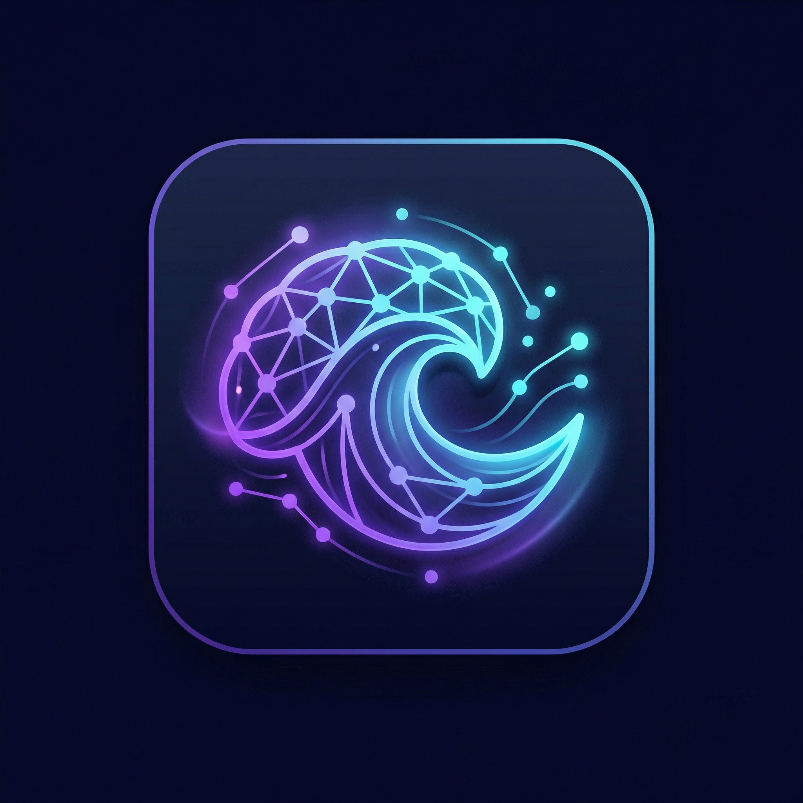
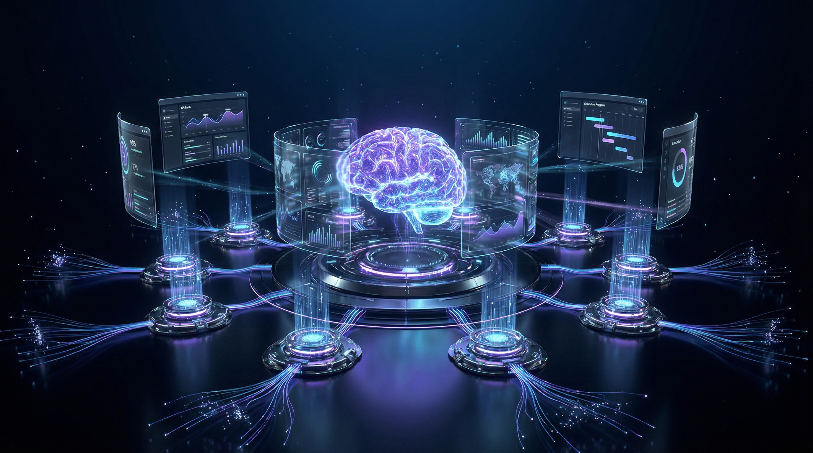
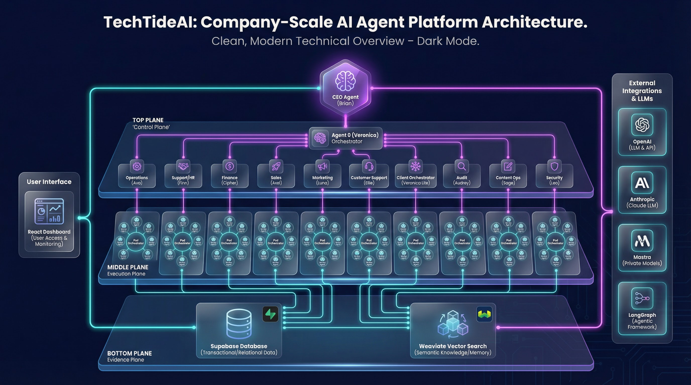

<div align="center">



# TechTideAI

### The AI Agent Platform That Runs Your Entire Company

**A CEO agent, 10 orchestrators, and 50 specialized workers — operating as a fully autonomous digital workforce on a shared execution fabric.**

[](LICENSE)
[](https://www.typescriptlang.org/)
[](https://react.dev)
[](https://fastify.dev)
[](https://supabase.com)
[](https://mastra.ai)

[Quick Start](#-quick-start) · [Architecture](#-architecture) · [Agent Roster](#-agent-roster) · [Documentation](#-documentation) · [Contributing](#-contributing)

---



</div>

## What Is TechTideAI?

TechTideAI is a **company-scale AI agent platform** — not a chatbot, not a copilot, but an entire organizational hierarchy of AI agents that mirrors how real companies operate. A CEO agent sets strategy. Orchestrators manage departments. Workers execute tasks with evidence, citations, and audit trails.

Think of it as deploying an AI-native company inside your infrastructure.

> Every decision is traceable. Every action is logged. Every agent knows its role, its boundaries, and its reporting chain.

---

## Why This Exists

Most AI agent frameworks give you a single agent or a flat swarm. Real companies don't work that way. They have **hierarchy, specialization, accountability, and evidence-based decision-making**.

TechTideAI implements all four:

| Principle | How It Works |
|---|---|
| **Hierarchy** | CEO → Orchestrators → 5-worker pods. Clear chain of command. |
| **Specialization** | Each agent has a defined role, tools, and behavioral constraints |
| **Accountability** | Every run, decision, and artifact is logged in Supabase with full audit trails |
| **Evidence** | All decisions tie to citations, KPIs, and vector-searchable evidence in Weaviate |

---

## Features

- **Three-Plane Architecture** — Control Plane (strategy), Execution Plane (tasks), Evidence Plane (audit + search)
- **61 AI Agents** — 1 CEO + 10 orchestrators + 50 specialized workers
- **Mastra + Claude SDK Runtime** — TypeScript-first agent execution with Python LangGraph/LangChain tools
- **Multi-LLM Routing** — OpenAI and Anthropic adapters with intelligent model selection
- **Supabase Backend** — Migrations, RLS policies, seed data, and full audit logging
- **Weaviate Vector Search** — Semantic knowledge retrieval across all agent artifacts
- **React Operator Dashboard** — Agent monitoring, run history, console, and KPI views
- **CI/CD Pipelines** — GitHub Actions for CI, deployment, and PR validation
- **Evidence-First Design** — Every agent reports risks, assumptions, confidence levels, and citations

---

## Architecture

<div align="center">

</div>

### Control Plane

The CEO agent and orchestrators define objectives, allocate resources, and manage risk. Decision logs map to measurable KPIs and dependencies.

### Execution Plane

Worker agents execute scoped tasks in 5-worker pods per orchestrator. Runs, events, artifacts, and knowledge documents are stored in Supabase for auditability.

### Evidence Plane

All decisions are tied to citations, KPIs, run artifacts, and vector-searchable evidence in Weaviate. Observability is enforced through run events and tooling logs.

### Tech Stack

| Layer | Technology |
|---|---|
| **Frontend** | React 18 + Vite + Tailwind CSS (shadcn-lite patterns) |
| **Backend** | Fastify + TypeScript orchestration APIs |
| **Agent Runtime** | Mastra (TypeScript) + Claude Agent SDK scaffolding |
| **Python Tools** | LangGraph + LangChain |
| **Database** | Supabase (PostgreSQL + migrations + RLS) |
| **Vector Search** | Weaviate |
| **LLM Providers** | OpenAI + Anthropic (multi-model routing) |
| **CI/CD** | GitHub Actions |

---

## Agent Roster

### Executive Agents

| Agent | Role | Description |
|---|---|---|
| **Brian Cozy** | CEO | Strategic decision support, KPI review, prioritization, long-range planning |
| **Veronica Cozy** | Agent 0 / Orchestrator | Coordinates all agents, manages executive workflows, central brain |

### Domain Orchestrators

| Agent | Domain | Description |
|---|---|---|
| **Ava Cozy** | Operations | SOPs, task routing, internal workflows, documentation |
| **Finn Cozy** | Support & HR | Hiring, onboarding, internal Q&A, policy handling |
| **Cipher Cozy** | Finance & Data | Reporting, forecasting, margin analysis, dashboards |
| **Axel Cozy** | Sales | Lead qualification, outbound workflows, CRM, pipeline insights |
| **Luna Cozy** | Marketing | Campaign planning, content assistance, audience research |
| **Ellie Cozy** | Customer Support | Call handling, intake, routing, scheduling, FAQ |
| **Audrey Cozy** | AI & Workflow Audit | Diagnose inefficiencies, surface ROI opportunities |
| **Sage Cozy** | Content Ops | Turn builds, workflows, and metrics into content assets |

### Workers

Each orchestrator maintains a **5-worker pod** (50 workers total) aligned to their domain. Workers execute scoped tasks and report results with evidence, limitations, and next actions.

---

## Quick Start

### Prerequisites

- **Node.js** >= 20
- **pnpm** >= 9
- **Python** 3.11+ (for LangGraph/LangChain tools)
- **Supabase CLI** (for local database)
- **Docker** (for Weaviate)

### 1. Clone and Install

```bash
git clone https://github.com/Alexi5000/TechTideAI2.git
cd TechTideAI2
pnpm install
```

### 2. Configure Environment

```bash
cp backend/.env.example backend/.env
cp frontend/.env.example frontend/.env
cp agents/.env.example agents/.env
```

Set your API keys: `OPENAI_API_KEY`, `ANTHROPIC_API_KEY`, `WEAVIATE_URL`, and Supabase credentials.

### 3. Start Infrastructure

```bash
# Start Weaviate (vector search)
docker compose -f database/weaviate/docker-compose.yml up -d

# Initialize Supabase (local)
supabase start --workdir database
```

### 4. Start Services

```bash
# Terminal 1: Backend API (http://localhost:4050)
pnpm -C backend dev

# Terminal 2: Frontend Dashboard (http://localhost:5180)
pnpm -C frontend dev

# Terminal 3: Agent Runtime (Mastra dev server)
pnpm -C agents dev
```

### 5. Python Tools (Optional)

```bash
cd agents/python
python -m venv .venv
source .venv/bin/activate  # or .venv\Scripts\activate on Windows
pip install -e ".[dev]"
```

> Full setup guide: [docs/DEV_SETUP.md](./docs/DEV_SETUP.md)

---

## Project Structure

```
TechTideAI2/
├── frontend/              # React operator dashboard
│   └── src/
│       ├── pages/        # Dashboard, Agents, Runs, Console
│       ├── components/   # UI components (shadcn-lite)
│       └── hooks/        # Custom React hooks
├── backend/               # Fastify orchestration API
│   └── src/
│       ├── routes/       # API endpoints
│       ├── services/     # Business logic
│       ├── domain/       # Domain models
│       └── repositories/ # Data access layer
├── agents/                # Agent definitions and runtime
│   ├── agents.md         # Full agent catalog
│   ├── skills/           # CEO strategy, orchestrator playbooks, worker research
│   ├── tools/            # Execution map, knowledge base, LLM router, market intel
│   ├── src/
│   │   ├── core/        # Agent registry, types, runtime
│   │   ├── mastra/      # Mastra agent runtime
│   │   ├── claude/      # Claude Agent SDK scaffolding
│   │   └── runtime/     # Execution engine
│   └── python/           # LangGraph + LangChain tools
├── apis/                  # External provider adapters (OpenAI, Anthropic)
├── database/
│   ├── supabase/         # Migrations, RLS policies, seed data
│   └── weaviate/         # Vector search configuration
├── docs/                  # Architecture and setup documentation
└── .github/               # CI/CD workflows, PR templates, CODEOWNERS
```

---

## Documentation

| Document | Description |
|---|---|
| [Architecture](./docs/ARCHITECTURE.md) | Three-plane system design and code boundaries |
| [Dev Setup](./docs/DEV_SETUP.md) | Local development environment setup |
| [Agent Catalog](./agents/agents.md) | Complete agent roster with roles and constraints |
| [CLAUDE.md](./CLAUDE.md) | Claude Code integration instructions |

---

## Development

### Scripts

```bash
pnpm dev:frontend     # Start React dashboard
pnpm dev:backend      # Start Fastify API
pnpm dev:agents       # Start Mastra agent runtime
pnpm build            # Build all workspaces
pnpm lint             # Lint all workspaces
pnpm test             # Test all workspaces
```

### CI/CD

TechTideAI ships with three GitHub Actions workflows:

- **ci.yml** — Runs on push: lint, typecheck, test
- **pr.yml** — Runs on pull requests: validation + review checks
- **deploy.yml** — Production deployment pipeline

---

## Roadmap

- [ ] Agent marketplace for community-contributed agents
- [ ] Visual workflow builder for agent orchestration
- [ ] Real-time collaboration between human operators and agents
- [ ] Multi-tenant deployment for agency/client use cases
- [ ] Mobile operator companion app
- [ ] Advanced analytics and agent performance scoring

---

## Contributing

Contributions are welcome. Please read the [pull request template](.github/pull_request_template.md) before submitting PRs.

1. Fork the repository
2. Create a feature branch: `git checkout -b feat/your-feature`
3. Commit with [Conventional Commits](https://www.conventionalcommits.org/)
4. Push and open a PR

---

## License

MIT — see [LICENSE](./LICENSE) for details.

---

<div align="center">

**Built by [Alex Cinovoj](https://github.com/Alexi5000) · [TechTide AI](https://github.com/Alexi5000)**

*Your company, automated.*

</div>
